# Creating a new UI theme by copying the Basic Theme (for MVC UI)

In this article, we will create a new UI theme by copying the Basic Theme and make some changes to it.

###In brief, the steps are: 
 * Create a new solution
 * Copy the `.Theme.Basic` project into the solution from the Githup repo
 * Remove the Basic Theme nuget package in the `.Web` project
 * Build `.Theme.Basic` project and fix errors
 * Reference the newly added local `.Theme.Basic` project in the `.Web` project
 * Make some changes in `.Theme.Basic` project to see it in action 

Let's get into the details step by step.

##  Create a new solution

Use the `new` command of the ABP CLI to create a new project:

````shell
abp new MyTheme
````
In case if you don't have ABP CLI installed on your environment, you can install or update it using the following commands.
````shell
dotnet tool install -g Volo.Abp.Cli
dotnet tool update -g Volo.Abp.Cli
````

Now open the created solution in Visual Studio.

We need to apply migrations to create the database. 

To apply database migrations right-click to the `.DbMigrator` project and select **Set as StartUp Project**

Hit F5 to run the application.

When the database migrations successfully completed, close the debug console window.

Now right-click to the `.Web` project and select **Set as StartUp Project**

When you run the application, the index page will show up in your browser as seen below.

 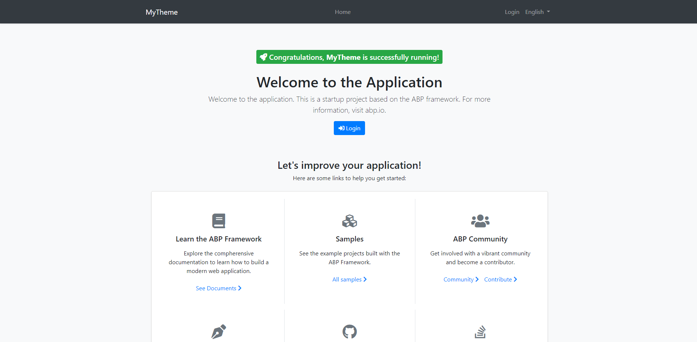
 ##  Copy the `.Theme.Basic` project into the solution from the Githup repo
 To create a new theme, copy the [Basic Theme Source Code](https://github.com/abpframework/abp/tree/dev/framework/src/Volo.Abp.AspNetCore.Mvc.UI.Theme.Basic) into your `src` folder. 
  
  Once you get a copy of the theme in your solution, right-click on the `src` folder and select Add > Existing Project.
  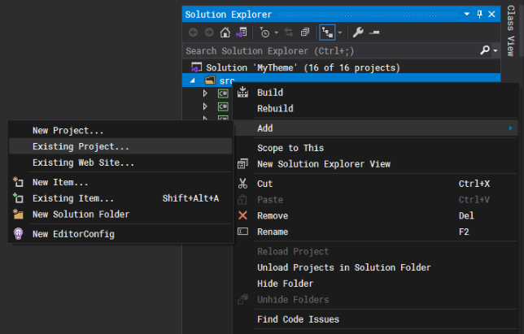
  
  In the file dialog select the `Volo.Abp.AspNetCore.Mvc.UI.Theme.Basic.csproj` file and click Open button to add the project to your solution.
  
  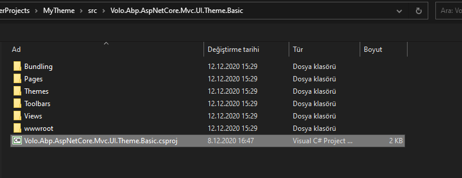
  ##  Remove the Basic Theme nuget package in the `.Web` project
To remove the `Volo.Abp.AspNetCore.Mvc.UI.Theme.Basic` NuGet package in your `.Web` project right-click on your `.Web` project and click on `Manage Nuget Packages...`

Then click Uninstall.

  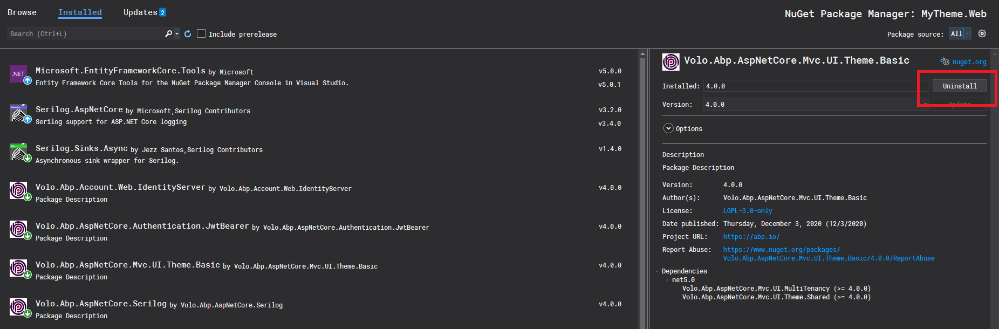

  ##  Build `.Theme.Basic` project and fix errors

When you build the `.Theme.Basic` Project you will get some errors.

First, open the `Volo.Abp.AspNetCore.Mvc.UI.Theme.Basic.csproj` file and delete the 4 rows as seen in the image below
 because these project references are not valid anymore.
 
  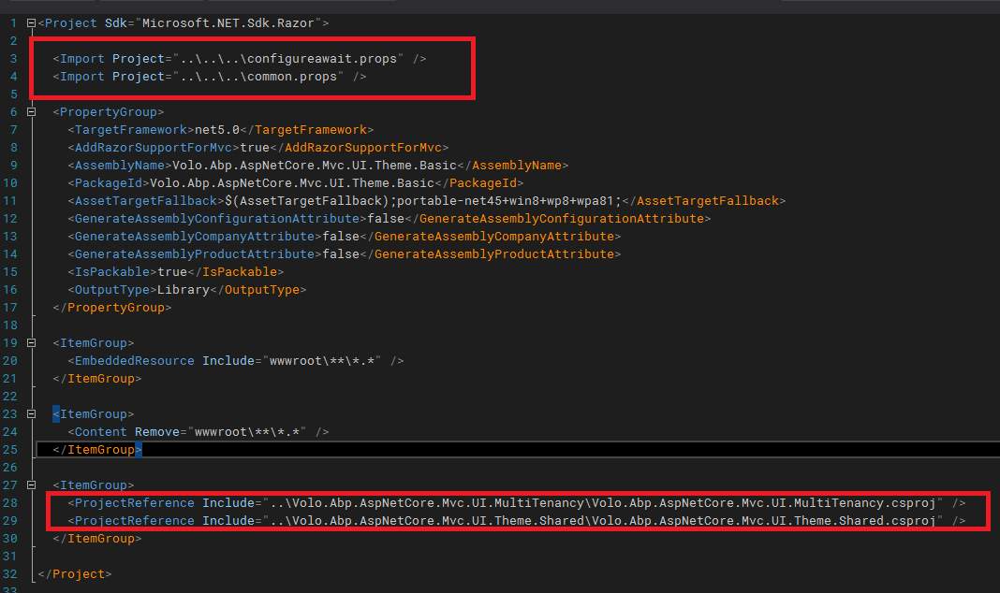

Then, right-click on your `.Theme.Basic` project and click on `Manage Nuget Packages...`

  On the `Browse` tab, search for `Volo.Abp.AspNetCore.Mvc.UI.MultiTenancy` and install it.
  
  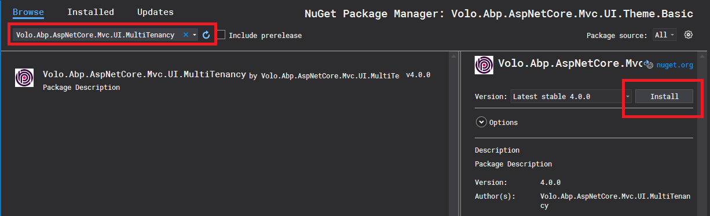
  
At the time of writing this article, this fixes the errors, but if you face other reference issues simply search for that package and install it.

Now build the `.Theme.Basic` Project again and see if everything is ok.

##  Reference the newly added local `.Theme.Basic` project in the `.Web` project

We will add a reference for the newly added `.Theme.Basic` project in the `.Web` project.

For this right-click to Dependencies on your `.Web` project and click on `Add Project Reference`

  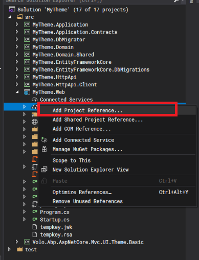
  
  In the opened window, select `.Theme.Basic` project and click Ok.
  
  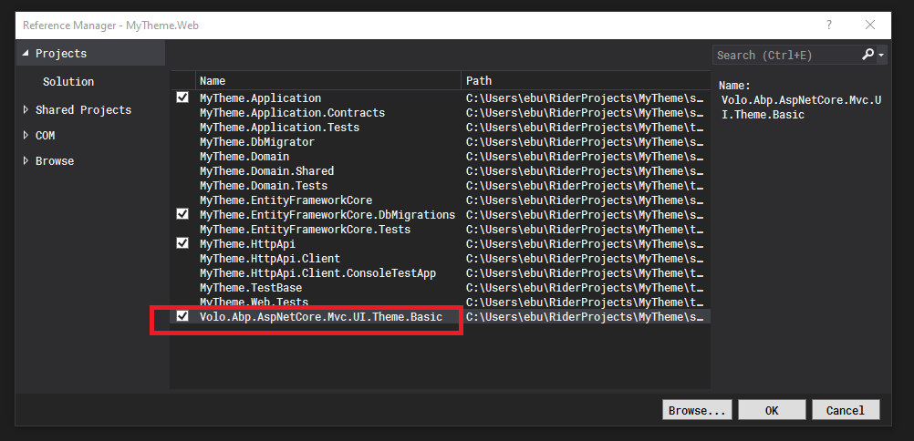
  
 ## Make some changes in `.Theme.Basic` project to see it in action 
  
 Time to make some changes.
 
 Open the layout file `Application.cshtml` file located at /Themes/Basic/Layouts folder in the `.Theme.Basic` project.
 This is the default layout which is used by the main application pages.
  
  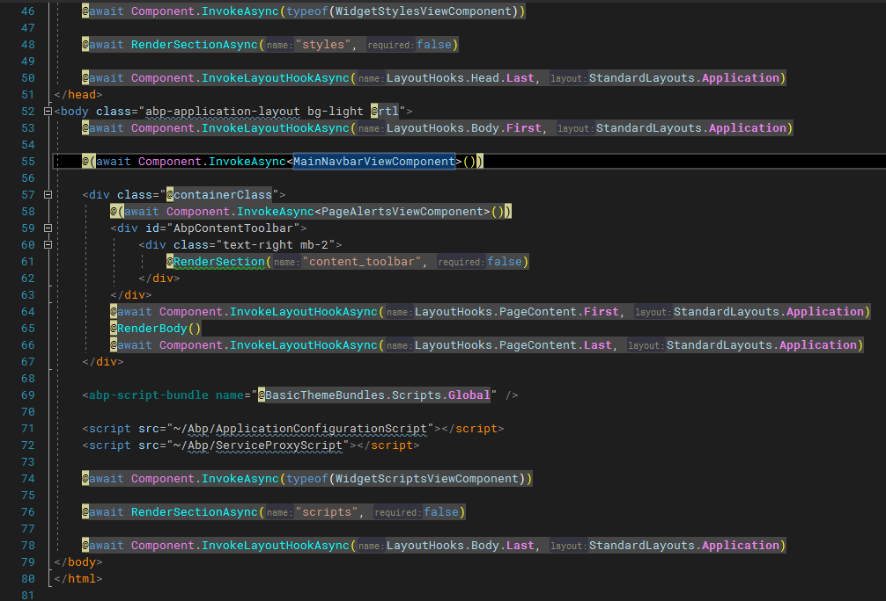
  
  Here we can see that the layout composed of some ViewComponents. 
  
  Let's add some text next to the branding name located at the main navbar.
  
To achieve this open the `Default.cshtml` file located at /Themes/Basic/Components/Brand folder. 
And add `Hi! There` after `@BrandingProvider.AppName`, and run the `.Web` project.
  
  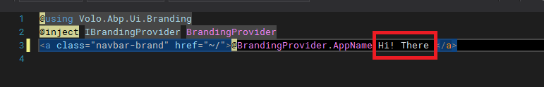
  
  🏆And Voila! here is the result.
  
  Now, we have our own copy of the Basic Theme and can do whatever we want.
  
  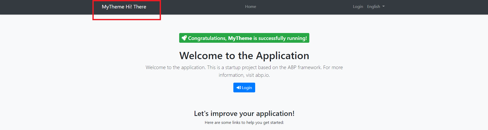
  
  From now on it is up to your imagination.
  
  You can modify the theme, add your custom css/js files, or your custom ViewComponents, etc. 

Find more about adding global styles/scripts and other fundamentals about ABP theming [here](https://docs.abp.io/en/abp/latest/UI/AspNetCore/Theming).

For Bundling & Minification check [this](https://docs.abp.io/en/abp/latest/UI/AspNetCore/Bundling-Minification) document.

Get the source code on [GitHub](https://docs.abp.io/en/abp/latest/UI/AspNetCore/Bundling-Minification). 

###Enjoy and have fun!